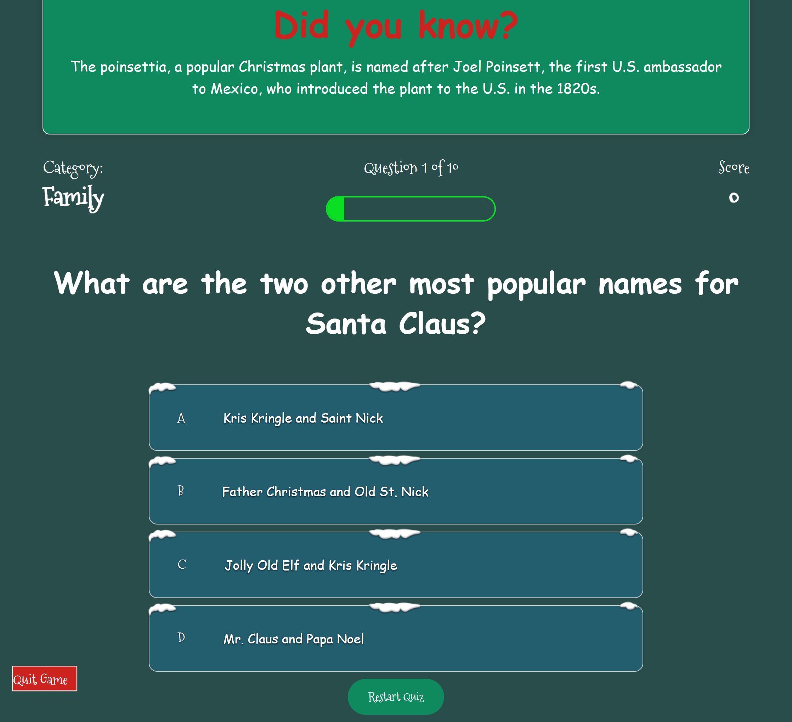
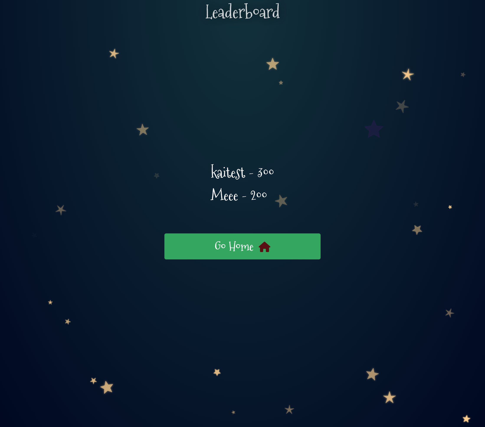
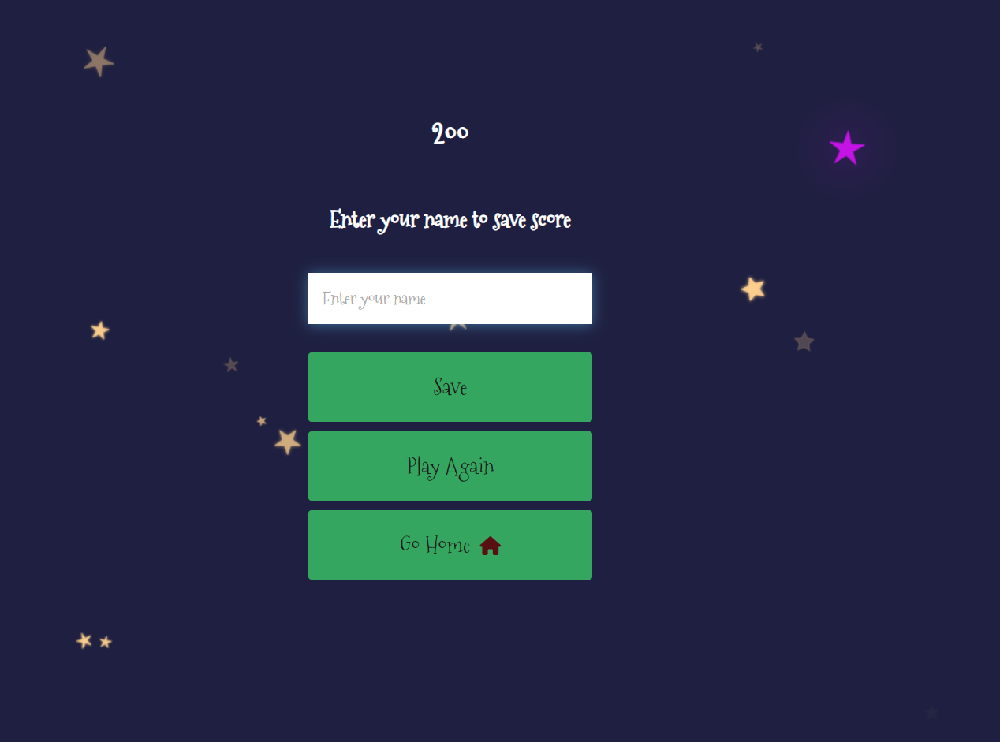
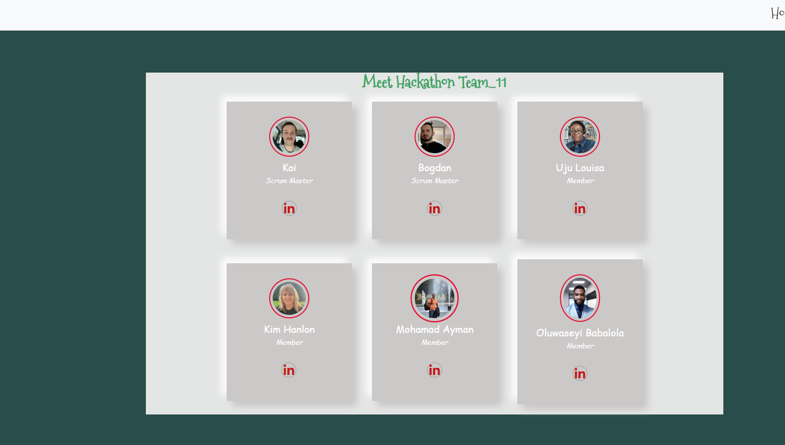

Tech The Halls


## Intro
Tech The Halls welcomes you all to try our amazing quiz called COOL QUIZ NAME. You can play the game [here.](https://github.com/Dekeypetey40/hackathon-team-11/)

#

### Team Tech_The_Halls 

This  site  is dedicated to the Christmas Seasoners. It features three navbar menu, the landing page being a welcome page which provides a direct link to the Quiz  page which allows for a user to chose which type of Game/quiz to play.There are three catgotries of Quiz to select. There  are Family, Tech and History categories.
The 'Story page features a few paragraphs of text about ancient hist of Chrimas tree and also features a few iFrames of the christmas movie and music.The last page is the Get in Touch page, where a user can can make an enquiry by filling a simple form.


View the live site
 [here](https://dekeypetey40.github.io/Quizmas-Quest/).


## Features 

### Site wide

### Landing Page
* This page features  welcoming the user to the website.
* At the bottom of the page, there is a link to the our socialmedia platorm and a buttion to Play the quiz.


### Categories of Quiz section
* This page features the categories of Quiz to chose from . 

* Here the user will type of quiz to play.








### Get in touch page
*	This contact form is implemented to allow users to contact 'Tech the Halls' 
*	Username (is a must;  if a user did not input their name, the system will warn that the name must be written)
*	Email (is a must; if the user did not input their email, or input some text without "@", the user will be notified.)



### Features Left to Implement

* As a future enhancement, the contact form will notify the user that their email was successfully submitted to the team's email account.
* There would be dedicated Twitter, youtube, and Facebook handle dedicated to 'Team_11'

## Design 

### WireFlame
* At the very beginning of the project, the Scrum Master instructed the Team Members to create a simple wireframe of the landing page to get creative juices flowing. All of which contributed a little bit of something to the final project.


### Colour Scheme
We chose the site's colours to mirror the iconic Beetlejuice (purple, green, black and white).


## Technologies

* HTML5
    * The structure of the Website was developed using HTML as the main language.
* CSS3
    * The Website was styled using custom CSS in an external file.
* JavaScript
    * The website's interactive aspects were contstructed using Javascript in an external file.
* Bootstrap 5.3.2
    * The Website Navbar was from Bootstrap 5.3.2
* GitHub
    * Source code is hosted on GitHub and delpoyed using Git Pages.
* Git 
    * Used to commit and push code during the development of the Website
* Font Awesome
    * Icons obtained from https://fontawesome.com/ were used as the Social media links in the footer section. 


## Testing 

### Responsiveness

All pages were tested to ensure responsiveness on screen sizes from 320px and upwards as defined in [WCAG 2.1 Reflow criteria for responsive design](https://www.w3.org/WAI/WCAG21/Understanding/reflow.html) on Chrome, Edge, Firefox and Opera browsers.

Steps to test:

1. Open browser and navigate to Home page
2. Open the developer tools (right click and inspect)
3. Set to responsive and decrease width to 320px
4. Set the zoom to 50%
5. Click and drag the responsive window to maximum width

Expected:

Website is responsive on all screen sizes and no images are pixelated or stretched.
No horizontal scroll is present.
No elements overlap.

Actual:

Website behaved as expected with the exception of switching to landscape . 

Website was also opened on the following devices and no responsive issues were seen:

- Oukitel C21 Pro
- TCL 30 Pro
- iPhone SE
- Samsung Galaxy Tablet

### Accessibility

[Wave Accessibility](https://wave.webaim.org/) tool was used throughout development and for final testing of the deployed website to check for any aid accessibility testing.

Testing was focused to ensure the following criteria were met:

- All forms have associated labels or aria-labels so that this is read out on a screen reader to users who tab to form inputs
- Color contrasts meet a minimum ratio as specified in [WCAG 2.1 Contrast Guidelines](https://www.w3.org/WAI/WCAG21/Understanding/contrast-minimum.html)
- Heading levels are not missed or skipped to ensure the importance of content is relayed correctly to the end user
- All content is contained within landmarks to ensure ease of use for assistive technology, allowing the user to navigate by page regions
- All not textual content had alternative text or titles so descriptions are read out to screen readers
- HTML page lang attribute has been set
- Aria properties have been implemented correctly
- WCAG 2.1 Coding best practices being followed

Manual tests were also performed to ensure the website was accessible as possible and an accessibility issue was identified.

Issue : After keyboard controls were implemented, while testing the site with windows 'Narrator' screenreader, it was not clearly known what the purpose of the labels/checkboxes were. An aria-label label was added to the labels for screen readers to alert them that the labels were clickable and what their purpose was. Note:  I was only able to perform thise text of th e time factor.

### Lighthouse Testing

#### Welcome Page


#### Game Page


#### Story Page


#### Get in Touch Page


### Functional Testing

#### Navigation Links

Testing was performed to ensure all navigation links on the respective pages, navigated to the correct pages as per design. This was done by clicking on the navigation links on each page.

| Navigation Link | Page to Load    |
| --------------- | --------------- |
| Home           | index.html |        
| Story        | story.html    |
| Ge in Touch    | contact.html    |

All link navigated to the correct pages as exptected.

**Form Testing**

The form on the  Home page was tested to ensure it functioned as expected when correct data was input and when incorrect data was input. The following test scenarios were covered:

*Scenario*

Steps to test: As expected

1. Navigate to [Category of Quiz by cliking Hom page]( https://)
2. Enter the name of the victim to be curse:
    Name: AdeBe 
3. Click Here to make a start!
     This produces a sound
4. Click Here to get in the middle of your Curse!
    This produces a sound
5. Click Here to cast the last part of your Curse
  This produces a sound


**Footer Social Media Icons / Links**

Testing was performed on the Font Awesome Social Media icons in the footer to ensure that each one opened in a new tab and that each one had a hover affect color.

Each item opened a new tab when clicked as expected and correct hover color was present.

**Get in touch form**
Testing was performed on the contact page. Submitting a message on the form will navigate to Formspree Success Page

### Scenario One - Correct Inputs

Steps to test:
### If the user inputs the user name and correct email with email format.
Full Name: Macj Moen
Email; abe@gmail.com
Submit;
on clicking submit, It will navigate the user to Successful Message, 

### Scenario two - blank Inputs

Steps to test:
But  if the user e.g;
Full Name:
Email; uju@gmail.com
Submit;
on clicking submit, there will a message telling the user that name filed must not be empty

### Scenario One - incorrect email Inputs

Steps to test:
But  if the user e.g;
Full Name: Code Silver
Email; gmail.com
Submit;
on clicking submit, there will a message telling the user that email field must contain @ 

### Actual:
Website behaved as expected


### Validator Testing 

- HTML
  - No errors were returned when passing through the official [W3C validator](https://validator.w3.org)
### story section


### Get in Touch


### Contact section


- CSS
  - There were no errors found when passing through the official [W3C validator](https://validator.w3.org)


- JS
  - There were no errors found when passing through the [JSHint Validator](https://jshint.com/)

## Bugs

### Fixed Bugs
#### Premature curse
##### Bug


!


##### Fix
To fix this all we had to d....


## Deployment

### Version Control

The site was designed and created by a team of 6, using a variety of code editors and was pulled and pushed to the "Beetlejuice" Git Hub repository.

The following git commands were used throughout development to push code to the remote repo:

```git pull origin main ``` - This command is used to fetch changes from a remote repository and integrate them into your current local branch..

```git add <file>``` - This command was used to add the file(s) to the staging area before they are committed.

```git commit -m “commit message”``` - This command was used to commit changes to the local repository queue ready for the final step.

```git push origin <branch-name>``` - This command was used to push all committed code to the remote repository on github.

```git checkout ``` -  This Git command is used for changing the current branch you're working on.

```git checkout -b <branch-name>``` - This Git command is used for creating a new branch


### Deployment to Github Pages

The live link can be found here -  https:/

## Team Collaborators
- - **Bogdan** - [GitHub](https://github.com/KTC96), [LinkedIn](https://www.linkedin.com/in/kyle-clow-43471b130/)
  Co-Scrum Master/ Frontend / Documentation
  - **Kai** - [GitHub](https://github.com/andrewdempsey2018), [LinkedIn](https://www.linkedin.com/in/andrew-dempsey-20ab40180/)
  Co-Scrum Master/Backend/ Frontend / Documentation
    - **Kim Hanlon** - [GitHub](https://github.com/kimatron), [LinkedIn](https://www.linkedin.com/in/kimhanlon291354)
   Design/ Frontend / Documentation
  - **Mohamad Ayman** - [GitHub](https://github.com/rinalds98), [LinkedIn](https://www.linkedin.com/in/rinalds-zimelis/)
  Backend/Design/ Frontend / Documentation
  - **Oluwaseyi Babalola** - [GitHub](https://github.com/Aylamccarthy), [LinkedIn](https://www.linkedin.com/in/ayla-mccarthy-a666565/)
   Design/ Frontend / Documentation
    - **Uju Louisa Adimora** - [GitHub](https://github.com/ujuadimora-dev), [LinkedIn](https://www.linkedin.com/in/adimora-uju-louisa-48b821179/)
   Design/ Frontend / Documentation

## Agile
### Github Projects
* At the beginning of the project, team members had a brainstorm to think of ideas that the site could include. These were divided into 'Must have', 'Should have', 'Could have' and Done.
* At the beginning of every day, the issues posted to the GitHub project board were assigned to different members, with 'Must Have' issues being highest priority and 'Could have' being lowest priority.
* At the end of the day, the board would be readjusted based on what projects were completed on that day, and which remaining projects were more vital to the site.
* Upon completion, all issues in the project were completed.


### Issues
* The issues posted to the GitHub project were based on the User Stories the team had brainstormed on the first day of development.


## Credits 

* https://www.w3schools.com/ Some of the code was used from this site to create form. Styles were changed to suit styling on our Website. I recommend this site for all beginners.

* https://stackoverflow.com This site also help our in resovlving some issue in coding

### Content 
* Background Image - "Image by pikisuperstar on freepik" - [freepik.com](https://www.freepik.com/free-vector/halloween-decorative-background_9694093.htm?epik=dj0yJnU9UVFaYWdqT2lYeDkweERZdm00eUFDbGxGdFhGX1p6UnQmcD0wJm49NGZOcjktNHZkazNGTy1fY0FXUVpkQSZ0PUFBQUFBR1V5T0c4&sign-up=google)
